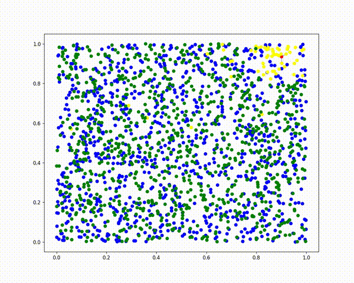

# Merging Hierarchical Navigable Small World Graphs
Python implementaion of fast algorithms for merging Hierarchical
Navigable Small World Graphs: NGM, IGTM, CGTM. 

## Itra Graph Traversal Merge (IGTM)

An example work of IGTM algorithm

<video src="animations/NGM-n1000k5.mp4" width="600" autoplay loop muted></video>