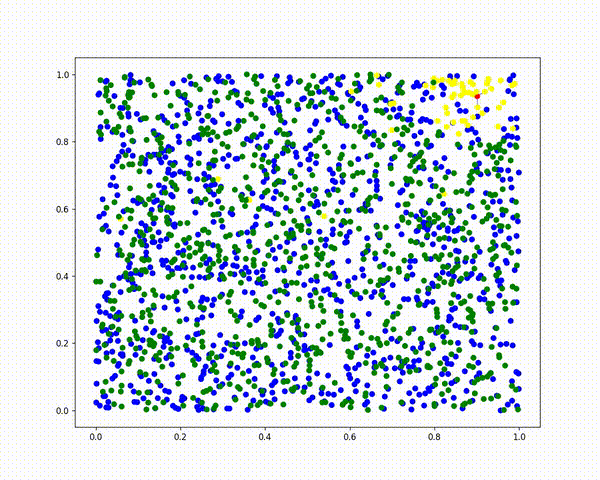

# Merging Hierarchical Navigable Small World Graphs
Python implementaion of fast algorithms for merging Hierarchical
Navigable Small World Graphs: NGM, IGTM, CGTM. 

Below are examples of the NGM, IGTM algorithms in action.
Blue points represent the vertices of the first graph, while green points represent the vertices of the second graph.
The edges of the first and second graphs are omitted for clarity.
The edges of the merged graph are shown as black lines.
Black points indicate the vertices whose neighborhoods in the merged graph were formed.
Yellow points represent the set of vertices for which the distances were calculated.

## Naive Graph  Merge (NGM)

## Itra Graph Traversal Merge (IGTM)

